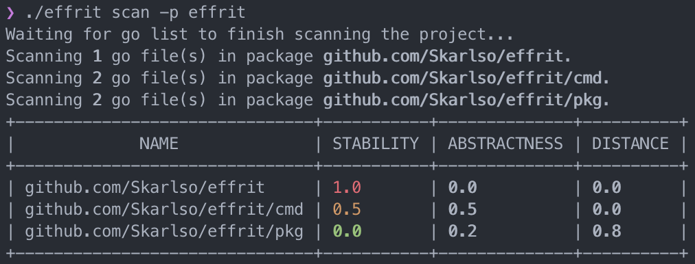
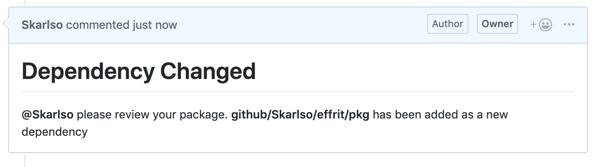

# Effrit

[](https://travis-ci.org/Skarlso/effrit)

Go Efferent and Afferent package metric calculator.

Metrics calculated currently by this package:

- [x] Instability metric
- [x] Abstractness metric
- [x] Distance from main sequence metric

All metrics are now supported and calculated accordingly.

# Description of these metrics

https://en.wikipedia.org/wiki/Software_package_metrics

Please see Robert Cecil Martin's Clean Architecture book on details describing those metrics.

In terms of what this tool is doing, please refer to this post: [Efferent and Afferent Metrics in Go](https://skarlso.github.io/2019/04/21/efferent-and-afferent-metrics-in-go/).

# Usage on Effrit

Here is an example of running this tool on this very project:



# Package Data

Effrit now dumps data as JSON file into the project root directly. Until I finish the CGUI for effrit, this data can be processed by any other tool. Example using Effrit project:

```json
{
   "packages":[
      {
         "Name":"effrit",
         "FullName":"github.com/Skarlso/effrit",
         "Imports":[
            "github.com/Skarlso/effrit/cmd"
         ],
         "ImportCount":1,
         "DependedOnByCount":0,
         "DependedOnByNames":null,
         "Stability":1,
         "Abstractness":0,
         "DistanceFromMedian":0,
         "Dir":"/Users/hannibal/goprojects/effrit",
         "GoFiles":[
            "main.go"
         ]
      },
      {
         "Name":"cmd",
         "FullName":"github.com/Skarlso/effrit/cmd",
         "Imports":[
            "github.com/Skarlso/effrit/pkg"
         ],
         "ImportCount":1,
         "DependedOnByCount":1,
         "DependedOnByNames":[
            "github.com/Skarlso/effrit"
         ],
         "Stability":0.5,
         "Abstractness":0.5,
         "DistanceFromMedian":0,
         "Dir":"/Users/hannibal/goprojects/effrit/cmd",
         "GoFiles":[
            "root.go",
            "scan.go"
         ]
      },
      {
         "Name":"pkg",
         "FullName":"github.com/Skarlso/effrit/pkg",
         "Imports":[

         ],
         "ImportCount":0,
         "DependedOnByCount":1,
         "DependedOnByNames":[
            "github.com/Skarlso/effrit/cmd"
         ],
         "Stability":0,
         "Abstractness":0.3,
         "DistanceFromMedian":0.7,
         "Dir":"/Users/hannibal/goprojects/effrit/pkg",
         "GoFiles":[
            "packages.go",
            "scan.go"
         ]
      }
   ]
}
```

# Running Effrit as a PR checker

Effrit now supports an exciting command. Effrit can be used as a monitor for package owners to see if a new dependency has been added to a package in a PR. Effrit sports a new command called `check-pr`. This can be executed as part of a PR checker.

Check PR must be called with the following parameters:

```bash
effrit check pr -o Skarlso -q 7 -r effrit -p effrit
# OR
effrit check pr --owner Skarlso --pr-number 7 --repo effrit --project-name effrit
```

This will compare the file that currently resides in the branch, called `.effrit_package_data.json` with a newly generated one.

If it detects that there are dependencies that weren't there before, Effrit, using a github token, will tag the owner of the package in the PR like this:



The owner comes from a comment in the Go file itself, like this:

```go
// Package pkg will save the universe from Thanos.
// @package_owner = @Skarlso
package pkg

func MyAwesomeFunc() {
   // Do something interesting.
}
```

Effrit will look in the package in all the Go files until it finds an owner. If not it will tag no-one but still comment.

It will not fail the PR, it will just leave a comment. If there are multiple people it will tag everyone in a single comment.

# Contributions

Are always welcomed!
